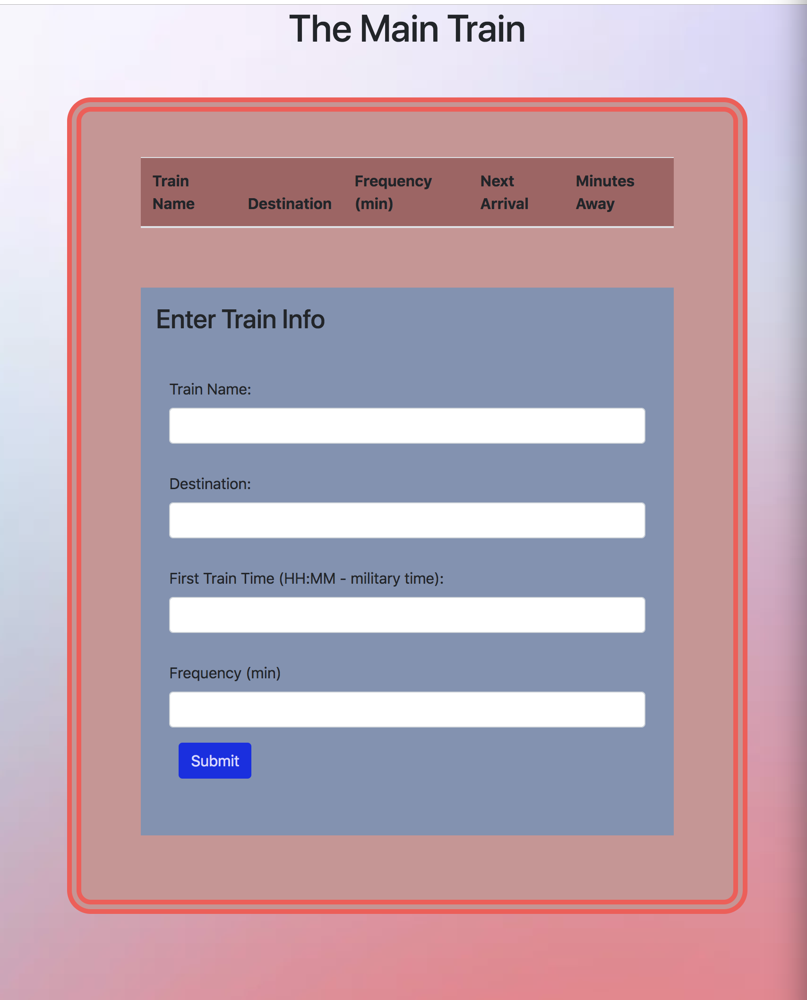

# FireBase - Train Scheduler Assignment

### **Overview**

In this assignment, I created a complex/dynamic form where the user can input their desired Train Information and be displayed the next available train and their wait time is also calculated. Using JavaScript for the core of the site and a dynamic button with jQuery to manipulate the HTML. Topped off with some Bootstrap and CSS to make a stylish and effective webpage. Made possible with displaying the time with Moment.js
 - - -
### **Interacting with the Form**

When the user arrives to the page, they are given 4 preliminary forms to fill out with the train name, their destination, First Train Time, and Frquency. Upon clicking submit, their informaiton will be gatherd and calculated to be displayed above the form in an organized by order table/list.




This Page was created with:
```
HTML
CSS
JavaScript
jQuery
Moment.js
Bootstrap
```

[Click Here to check your train times](https://ticola.github.io/FireBase/)